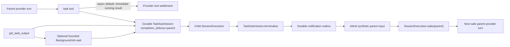

# Event-Driven V2 Subagent Loop Design

**Status:** Proposed for branch `999.0.6`

**Scope:** Research and design only. This document does not authorize deleting the legacy API or changing provider tool-call protocol semantics.

## Executive Decision

Keep the existing V2 provider loop and durable Session infrastructure. Evolve the existing `task` tool into an async-by-default spawn operation when background subagents are available, add a V2-native `get_task_output` tool for explicit snapshots and bounded waits, and use the existing durable task outbox to wake the parent Session whenever a child finishes.

Do not remove the provider turn's local-tool settlement barrier in `packages/core/src/session/runner/llm.ts`. A provider turn still needs one result for every tool call emitted in the same assistant message. The barrier becomes harmless because an asynchronous `task` call settles immediately with a running handle; the child continues outside that provider turn.

Do not replace EventV2/SQLite with Codex's process-local mailbox or cc-custom's iterator restart mechanism. OpenCode already has stronger durable primitives: `SessionInput`, `SessionExecution`, `TaskSubmission`, `TaskNotificationOutbox`, and process-local wake coalescing.

## What the Research Found

### The fork is already partly event-driven

The V2 outer loop is durable and event-driven:

- `SessionV2.prompt(...)` durably admits input before scheduling work.
- `SessionExecution.wake(sessionID)` starts or coalesces a Session drain.
- `TaskSubmission.terminalize(...)` records child completion and writes a durable notification outbox row.
- `TaskNotification.drain(...)` admits a synthetic parent input and wakes the parent Session.
- `SessionRunCoordinator` preserves repeated wake requests without running the same Session concurrently.

The remaining blocking behavior is inside a provider turn. `packages/core/src/session/runner/llm.ts` starts local tools eagerly, then waits for every tool fiber before calculating continuation. This is correct provider protocol behavior, not the place to implement asynchronous delegation.

### Why the screenshot waits for all four subagents

Three current choices combine into an all-agent barrier:

1. `task` defaults to foreground because `runInBackground` is currently `input.background === true`.
2. Default and model-specific prompts encourage batching independent tool calls into one assistant response.
3. The provider turn correctly waits for every foreground tool result.

The Core task implementation already supports `background: true`. Desktop explicitly enables it today, while the normal TUI server leaves it behind the experimental flag. The missing pieces are a V2-wide default and a complete durable delivery contract.

### Current correctness gaps

1. `TaskSubmission.terminalize(...)` writes a parent notification for both foreground and background tasks. A foreground result can therefore be delivered once as the direct tool result and again as a synthetic parent input.
2. The notification payload has only `{ state, description, text }`. It does not identify the child Session, so the parent cannot reliably correlate or resume a completed task.
3. `TaskSubmission` has no ownership-safe query for the latest invocation of a child Session. A status tool cannot safely expose arbitrary Session IDs.
4. Dynamic foreground-to-background promotion is process-local. The durable submission does not record that completion delivery moved from the current tool call to the parent notification channel.
5. There is no end-to-end test proving that child A can finish, wake the parent, and trigger a new provider turn while child B remains active.

### Desktop and TUI are already on the modern V2 API

The current Desktop client selects the modern API in `packages/app/src/utils/server-compat.ts`. Its modern prompt endpoint is defined by `packages/protocol/src/groups/session.ts` and handled by `packages/server/src/handlers/session.ts`, which calls `SessionV2.prompt(...)` directly.

The current TUI creates the native V2 client in `packages/tui/src/context/sdk.tsx` and submits ordinary prompts with `sdk.native.sessions.prompt(...)` in `packages/tui/src/component/prompt/index.tsx`. Its Session and tool timeline is also built from V2 durable events. The same Core task implementation therefore governs both Desktop and TUI.

`packages/opencode/src/server/routes/instance/httpapi/handlers/session.ts` and its `requiresLegacyPrompt(...)` branch are a compatibility surface for the old protocol. Removing that branch is not required to make current Desktop and TUI agent execution V2-native and would unnecessarily risk third-party and old-client compatibility.

## External Designs Worth Absorbing

### Codex CLI

Absorb:

- Spawn and wait are separate control operations.
- Agent completion becomes a new parent input instead of blocking the original provider turn.
- Explicit waiting is exceptional; the parent should continue useful work when possible.

Do not copy:

- A process-local mailbox as the source of truth. OpenCode must retain durable SQLite admission and replay.

### Grok Build

Absorb:

- Background execution defaults to true.
- `get_task_output` accepts one or more task IDs.
- Missing or zero timeout is a non-blocking snapshot; a positive timeout is a bounded wait.
- A single query tool is sufficient; a second `wait_tasks` compatibility tool is unnecessary here.
- Cap one multi-ID request at 20 IDs and preserve first-seen order after deduplication.

### cc-custom

Absorb:

- Completion notifications carry task ID, state, summary, and result.
- Each completion can create a new coordinator turn while other workers remain active.
- The coordinator is expected to react to completed work and schedule follow-up work without waiting for a whole batch.

Do not copy:

- Restarting a JavaScript async iterator to simulate background execution. OpenCode's durable task lifecycle and Session wake path already provide a safer boundary.

## Alternatives Considered

### Alternative A: Remove the provider tool barrier

Rejected. A provider assistant message that emits N tool calls needs N tool results before the next provider request. Returning to the provider before all local calls settle would create malformed or provider-specific history and would break existing settlement guarantees.

### Alternative B: Replace `task` with new `spawn_agent` and `wait_agent` tools

Rejected for the first cut. It has clean naming, but it duplicates permissions, specialized UI rendering, legacy task adapters, model guidance, and continuation semantics. It also forces a larger migration without improving the durable execution model.

### Alternative C: Keep `task`, make it async by default, and add `get_task_output`

Selected. Existing models, permissions, task cards, child-session continuation, and user expectations remain valid. `task` becomes the spawn operation; `get_task_output` provides explicit observation and bounded waiting. `background: false` remains an explicit compatibility escape hatch for a genuine immediate dependency.

## Target Architecture



The parent may receive one completion per turn when completions are separated in time. If several children finish before the parent reaches the next safe boundary, steer promotion may coalesce them into one provider turn. Coalescing is intentional: every completion remains a distinct durable input, but the system does not create redundant provider requests merely to preserve a one-event/one-request ratio.

## Durable Completion Delivery Contract

Add a non-null `completion_delivery` column to `task_submission`:

- `"tool"`: the foreground tool invocation owns delivery. Terminalization updates durable state but does not create a parent notification.
- `"parent"`: the original tool invocation has already returned. Terminalization creates the durable parent notification.

The generated migration must default existing rows to `"parent"`. This preserves the old behavior for unfinished rows created by previous versions, which is safer than losing a background completion. New foreground submissions explicitly use `"tool"`.

`completionDelivery` is part of invocation identity. Reusing the same `(parentSessionID, assistantMessageID, toolCallID)` with a different delivery mode is an invocation conflict, not an exact retry.

### Atomic promotion

Add `TaskSubmission.promoteDelivery(submissionID)` with idempotent transaction semantics:

- Nonterminal `"tool"` submission: change it to `"parent"`.
- Nonterminal `"parent"` submission: no-op.
- Terminal `"tool"` submission: change it to `"parent"` and create the deterministic outbox row in the same transaction.
- Terminal `"parent"` submission: ensure the deterministic outbox row exists, then no-op.

The BackgroundJob `onPromote` action must call this method before publishing a running checkpoint, then drain notifications. Draining is required when the child terminalized just before promotion: terminalization correctly created no outbox for `"tool"`, promotion creates it after the child's normal drain has already run. The extra drain is idempotent and closes the detach/completion race.

## Task Semantics

Background subagents become a standard V2 capability rather than a Desktop-only experimental default:

- `TaskTool.node` enables background operation by default for every V2 host.
- `packages/server/src/handlers/capability.ts` reports `backgroundSubagents: true` to modern V2 clients, including Desktop and TUI.
- `TaskTool.nodeWithOptions({ background: false })` remains available for focused tests.
- The legacy V1 task implementation and legacy experimental capability endpoint retain their existing environment gate. V1 execution is not silently upgraded by this work.

With the V2 capability enabled:

- Omitted `background` means asynchronous execution.
- `background: true` means asynchronous execution.
- `background: false` means explicit foreground execution.

When a V2 embedder explicitly disables the capability:

- The model schema continues to hide `background`.
- Omitted `background` remains foreground for compatibility.
- A manually supplied `background: true` fails with the existing capability error.

The model-facing description must state:

- Independent delegation is async by default.
- The parent will be woken automatically on completion.
- Use `background: false` only when the very next reasoning step cannot proceed without the result.
- Never batch multiple foreground `task` calls in one provider message.
- Use `get_task_output` only for a snapshot or a deliberate bounded dependency wait; do not poll repeatedly.

## `get_task_output` Contract

Input:

```ts
{
  task_ids: string[] // 1..20, trim and deduplicate while preserving order
  timeout_ms?: number // omitted or 0 = snapshot; positive = bounded wait for all
}
```

Authorization and identity:

- Every ID is a child Session ID returned by `task`.
- Resolve only submissions whose `parent_session_id` equals the current tool context Session.
- For a child continued by several `task` invocations, return the latest submission by `time_created`, then `id` as deterministic tie-breaker.
- Unknown and non-owned IDs produce the same `ToolFailure` so the tool cannot be used as a Session-ID oracle.

Output for each task:

- `taskID`
- `status`: `accepted`, `running`, `completed`, `error`, `cancelled`, or `recovery-required`
- `description`
- `agent`
- `timeCreated` and optional `timeCompleted`
- optional `result` or `error`

Waiting:

- A positive timeout waits for all requested nonterminal tasks or until the common deadline.
- Use process-local `BackgroundJob.wait(...)` only as an observation optimization.
- Re-read `TaskSubmission` after the wait; durable state is authoritative.
- If no process-local job exists, return the current durable snapshot instead of polling or pretending the task completed.
- Automatic completion notifications remain the primary event-driven mechanism. The query tool is not required for normal background completion.

## Notification Contract

New outbox payloads include `taskID`. The decoder remains backward compatible with old payloads by treating the field as optional and joining the referenced `task_submission` row when it is absent.

Preserve the existing outer tag and add stable identity:

```xml
<task id="ses_child" state="completed">
<summary>Review provider changes</summary>
<task_result>
...
</task_result>
</task>
```

This avoids a transcript format break while giving the parent the ID needed for correlation and continuation.

## Error and Recovery Semantics

- Child `completed`, `error`, `cancelled`, and `recovery-required` are all terminal and notify the parent when delivery is `"parent"`.
- Parent cancellation suppresses pending notifications as it does today.
- Notification admission remains idempotent through deterministic message IDs.
- A delivered-but-not-woken outbox row is replayed and wakes the parent after restart.
- Repeated wake requests may coalesce, but repeated input admission must not duplicate transcript records.
- Background process loss is represented by the existing recovery path; `get_task_output` must never infer success from a missing process-local job.

## V2 Boundary

This change makes the current Desktop and TUI subagent loops event-driven without deleting legacy compatibility:

- Modern Desktop prompt: `packages/app` current API → `packages/server` → `SessionV2.prompt`.
- Modern TUI prompt: `packages/tui` native client → `packages/server` → `SessionV2.prompt`.
- V2 tools and child execution: `packages/core` only.
- Old SDK/API prompt fallback: retained in `packages/opencode` and explicitly outside this implementation's deletion scope.

Add regression tests proving modern Desktop and TUI prompt requests use the V2 endpoint and V2 event projection. Any future global removal of `SessionPrompt.loop(...)` requires a separate protocol-deprecation design and migration window.

## Acceptance Scenarios

1. A parent emits four `task` calls without `background`; all four calls settle immediately as running and the provider turn does not wait for child completion.
2. Child A completes while B/C/D remain active. A durable synthetic input is admitted and the parent receives a new provider turn containing A's result.
3. Child B completes later and causes another parent wake. B does not depend on C/D.
4. A and B complete nearly simultaneously. Both durable inputs survive; the parent may process them in one coalesced provider turn.
5. `background: false` still blocks and returns the direct child result without creating a duplicate parent notification.
6. A foreground task promoted to background notifies exactly once even if completion races promotion.
7. Restart after outbox delivery but before wake results in one synthetic input and a replayed wake.
8. `get_task_output` returns durable snapshots, waits only up to its deadline, and rejects unrelated Session IDs.
9. Existing provider local-tool barrier tests continue to pass unchanged.
10. Current Desktop and TUI prompt submission remain V2-native; legacy API compatibility tests continue to pass.

## Rollout and Observability

- Graduate background subagents to a standard V2 capability for both Desktop and TUI while retaining the old V1 gate.
- Structured task output continues to expose `metadata.background` and child `sessionId` for the UI.
- Existing Desktop and TUI task cards remain the primary presentation for spawned children; `get_task_output` may use generic tool rendering in the first cut as long as its structured and model-facing output are readable on both surfaces.
- Add debug logs or test-visible events only at durable boundaries: submission accepted, delivery promoted, terminalized, notification admitted, wake requested.
- Do not log full task prompts or results.

## Explicit Non-Goals

- Removing `SessionPrompt.loop(...)` and every V1 API route.
- Distributed Session ownership or remote-worker placement.
- Durable retry of in-flight provider work after process death.
- Changing provider tool-call ordering or returning an incomplete tool result set.
- Adding `spawn_agent`, `wait_agent`, and `wait_tasks` aliases in the first cut.
- Enforcing exactly one provider request per child completion.
